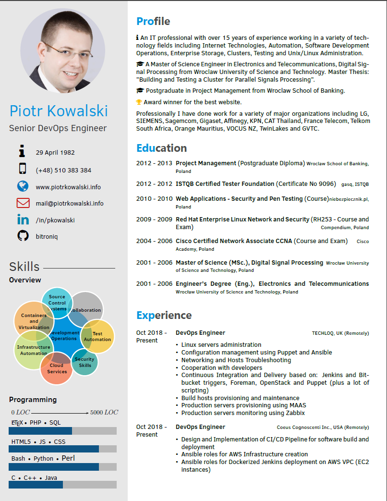

# ten-seconds-cv
> A LaTeX resume/cv template for DevOps Engineer to make quick update and
> pdf creation

This template I use for my own resume/CV.

I've compiled it with elements from several templates, including:

1. [Carmine Spagnuolo's Twenty Seconds Curriculum Vitae](https://github.com/spagnuolocarmine/TwentySecondsCurriculumVitae-LaTex)
2. [Carmine Benedetto's Smart Fancy LaTeX CV](https://github.com/neoben/smart-fancy-latex-cv)
3. [Adrien Friggeri's Fancy CV](https://www.sharelatex.com/templates/52fb8c1f33621a613683ecad)
4. [Harsh Gadgil opensorcer/Data-Engineer-Resume-LaTeX](https://github.com/opensorceror/Data-Engineer-Resume-LaTeX)



## Install pre-requisites (Windows)

1. Install [MiKTeX](https://miktex.org/howto/install-miktex), a TeX
   distribution for Windows that includes a large number of major packages.

2. Install an editor to edit and compile LaTeX documents:
  - [TexWorks](http://www.tug.org/texworks/) (comes with MiKTeX)
  - [TeXstudio](http://www.texstudio.org/)
  - [Texmaker](http://www.xm1math.net/texmaker/)

Once both the distribution and editor are installed, clone this repository
using `git clone` and open the template.tex file in your editor.

**Important**: Make sure to compile with XeLaTeX, not PDFLaTeX.
You're good to go!

## Install pre-requisites (Debian/Ubuntu)
* texlive: `sudo apt-get install texlive`
* texlive-xetex: `sudo apt-get install texlive-xetex`
* texlive-lualatex: `sudo apt-get install texlive-luatex`
* texlive-math-extra: `sudo apt-get install texlive-math-extra`
* texlive-fonts-extra: `sudo apt-get install texlive-fonts-extra`
* texmaker: `sudo apt-get install texmaker`

## Build
Open `template.tex` with `TexMaker` or `TexWorks` and compile using XeLaTeX

## Fontawesom support
To enable fontawesome support, include the fontawesome package in the cv.tex file
```
\usepackage{fontawesome}
```
and compile the document using LuaLaTex

## License

```
Copyright 2019 Piotr Kowalski

GNU GENERAL PUBLIC LICENSE
Version 3, 29 June 2007
```

